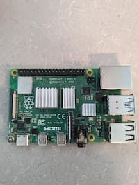
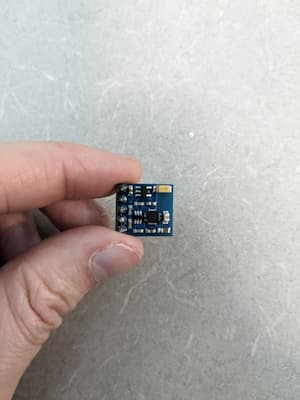
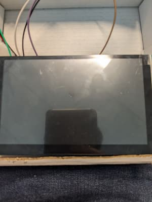

# Graphical GPS Project

A GPS web application meant to run on a Raspberry Pi. Draws a map, gets your location, and moves your position accordingly.

## Requirements/Installation

Create a python virtual environment. 
```
python -m venv .venv
source .venv/bin/activate
```
If you want the routing functionality, you'll also need Docker Engine later on in this guide.
Install the Python dependencies within `requirements.txt` and the Node packages listed within `static/package.json`:
```
pip install -r requirements.txt
cd static/
npm install
cd ..
```

### PMTiles

The .PMTiles file makes up the images that comprise the map. The pictures of the roads, buildings, etc. are all stored within a .pmtiles archive. Our JavaScript file requests the Flask server for a specific file in the archive so that it can render it on the map.

To get a PMTiles file for a specific region, [download the command line tool here.](https://github.com/protomaps/go-pmtiles/) You'll also need a link to the [latest basemap here](https://maps.protomaps.com/builds/) (right click download > copy link)

Once you have both of those things, you can use the `extract` command to get a specific region from the full basemap. Pass in a lat/lng bounding box with the `--bbox` parameter, encompassing the whole area you need your GPS to navigate. [bbox finder](http://bboxfinder.com) is a good way to automatically generate a boundary box for your needs.

As an example, this is what generating a .pmtiles file would look like for the entirety of Nova Scotia:
```
pmtiles extract [LATEST BASEMAP] nova_scotia.pmtiles --bbox=-66.45,43.37,-59.63,47.07
```

Place inside `static/maps` once you have your result.

### Routing

While PMTiles is great for map pictures, it doesn't actually contain any data regarding street or building names that we can easily navigate. We need a folder of `osrm.*` files to get that information, which we can then pass to our server to get a route between two points.

To start, you need an `osm.pbf` file. Download a regional data extract for your region, for example at [Geofabrik](http://download.geofabrik.de/).

Unpack the data into `osrm.*` files with the [`kradenko/osrm-backend:arm64`](https://hub.docker.com/r/kradenko/osrm-backend) docker images before running the server.
**IF YOU'RE NOT ON A RASPBERRY PI REPLACE EVERY `kradenko/osrm-backend:arm64` WITH `osrm/osrm-backend`**

Preprocess the data:
```
docker run -t -v "${PWD}:/data" kradenko/osrm-backend:arm64 osrm-extract -p /opt/car.lua /data/<your-file>.osm.pbf
```
Partition and customize the data:
```
docker run -t -v "${PWD}:/data" kradenko/osrm-backend:arm64 osrm-partition /data/<your-file>.osrm
docker run -t -v "${PWD}:/data" kradenko/osrm-backend:arm64 osrm-customize /data/<your-file>.osrm
```

## Running

Finally, run the routing server like so:
```
docker run -t -i -p 5500:5500 -v "${PWD}:/data" kradenko/osrm-backend:arm64 osrm-routed --algorithm mld --port 5500 /data/nova-scotia-latest.osrm
```

Then run the Python script. Your GPS should be available on localhost:5000.

## Physical Setup

This project uses the following commponents

1. Raspberry Pi 4 Model B
<p align="center"></p>

2. Adafruit Ultimate GPS Breakout v3
<p align="center"></p>

3. GY-271 QMC5883l Magnetometer
<p align="center"></p>
<p align="center"></p>

4. Freenove 5 Inch Touchscreen Monitor
<p align="center"></p>

5. A 5000 mAh LiPO Battery
<p align="center"></p>

6. A 16GB micro SD card
<p align="center"></p>

OS that was used for this project is Raspbian OS 64 bit. make sure you have that installed on your micro SD card before proceeding otherwise flash the OS to your micro SD card.

## Component Installation

When using pin numbers or names I will be refering to this image which is from the [Raspberry Pi Official Documentation](https://www.raspberrypi.com/documentation/computers/raspberry-pi.html).

<p align="center"></p>

### Adafruit Ultimate GPS Breakout v3

The Adafruit Ultimate GPS Breakout v3 reads data into serial port 0 of the raspberry pi and can be powered by a 5v or 3.3v power supply. it will provide you information in the form of GPS sentances. the details of these sentances can be veiwed on [GPS - NMEA sentence information](https://aprs.gids.nl/nmea/).

To connect it to the raspberry pi directly attach:
- vin pin on the GPS module to the 3.3v or 5v pin on the raspberry pi.
- The GND pin on the GPS to the Ground pin on the Raspberry Pi
- TX pin on the GPS to the TXD (GPIO 14) pin on the Raspberry Pi
- RX pin on the GPS to the RXD (GPIO 15) pin on the Raspberry Pi

You will need to install a couple of packages before you can read from the GPS. When you boot into Raspbian OS you will need to open the terminal and run `sudo apt update` then after that `sudo apt upgrade`. Then you will need to install gpsd and gpsd-clinets after this is done. run the command `sudo apt-get install gpsd gpsd-clients`. you should be able to run the command `cat /dev/serial0` to see GPS data coming from the module to serial port 0. **THIS MODULE WILL ONLY WORK OUTSIDE**.

### QMC5883l GY-271 Magnetometer

The QMC5883l is a module that measures the strength of the magnetic fields that interact with it. in this case that will be the earth. The device uses a I2C serial bus to communicate with the Raspberry Pi. This includes a Serial Data Line (SDA) pinout and a Serial Clock Line (SCL) pinout. The devices measures the strengh of the magnetic field on 3-axis (x, y, and z). we will only be using the x, and y to calculate the azimuth (angle from magnetic north).

The angle is calulated by getting the maximium and minimum values that the magnetometer reads for the x and y coordinates. **Think circle**. when y is max the angle should be 0°, when x is max the angle should be 90°, when y is minimum it should be 180°, and when x is at its minimum it should be 270°

<p align="center"></p>

From this we can see that 

$$tan(\theta) = \frac{y}{x}$$

now just rearrage to get

$$ \theta = tan^{-1}\left(\frac{y}{x}\right) $$

To wire this directly to the Raspberry Pi:
 - Connect the VCC pin on the magnetometer to a 3.3v or 5v pin on the Raspberry Pi
 - Connect the GND pin on the magnetometer to a GND pin on the Raspberry Pi
 - Connect the SDA pin on the magnetometer to the SDA (GPIO 2) pin on the Raspberry Pi
 - Connect the SCL pin on the magnetometer to the SCL (GPIO 3) pin on the Raspberry Pi